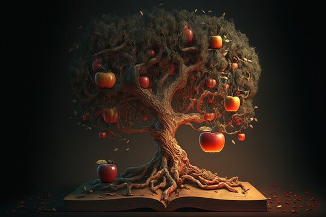

# yiai0424_major-project

## Instructions

The work utilizes **Perlin noise and random values** to drive animation of ''Apple Tree''. 

*( *Please note that the artwork does not require interaction to observe the apple's generation process )*

## Animation and difference

The design concept draws from a group project to explore the intersection of historical and futuristic art. In my individual work, I focus specifically on the apple itself, reimagining its past and future. 

My artwork depicts the natural lifecycle of an apple—growing, maturing, and ultimately falling—as time passes. This temporal progression is reflected in the evolving background and the changing colors of the apple. Additional, after the first generation of apples fall off, there will be a cycle of the next generation of apples growing, ripening, and falling off again.

*/ refer pic /*

The biggest difference between my work and my teammates is my apple  will fall, symbolizing the inevitable passage and impact of time.

## Technical interpretation

### Setup
- **windowResized():** Adjusts canvas size and reinitializes elements.

### Drawing:
- **draw():** Continuously called to render the frame, updating and drawing elements.
- **drawCanvas():** Draws background, oil painting effect, roots, bottom rectangle, branches, and trunk apple.

### Initialization:

- **initializeAll():** Clears and reinitializes apples and branches.
- **initializeBranches():** Creates branches and adds apples.
- **initializeBottomRectApples():** Places apples in the bottom rectangle.
- **initializeTrunkApple():** Creates a single trunk apple.

### Classes:

- **Branch:** Manages branch drawing and apples.
- **Apple:** Handles apple growth, falling, and drawing

### Perlin Noise:

- Perlin noise is utilized in the **Apple class** to simulate natural growth of the apples. Specifically, it's used in the update method of the Apple class.
- noise is a function that generates Perlin noise, and **this.noiseOffset** is used to drive the noise over time.

### Random Values:

- Random values are used extensively throughout the code to determine various properties such as positions, colors, sizes, and growth rates.
- Functions like **random()**  and **lerp()** (linear interpolation with random values) are used for creating randomness in positions and other properties.

### Array
- Referred to this web site below for ideas and ways to create how to drop the apple：https://happycoding.io/tutorials/p5js/arrays
- initializes apples with random diameters:**new Apple(appleDiameter, false)**
- updates the Y-coordinates of apples: **this.y += 5**
- When objects move off the canvas, resets apple:**if (this.y - this.diameter / 2 > height) { this.setPosition(random(0, width), 0); }**

## Change of code
- Most changes in branch class and apple class

* But there are other minor changes. I've labelled them all clearly in the comment

* - If the form of the comment is like this, 

* - it proves that the code after this comment or between the two comments is newly changed by me